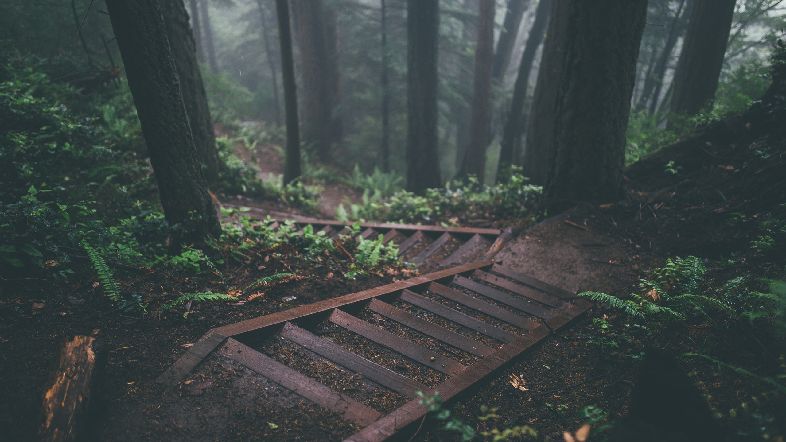
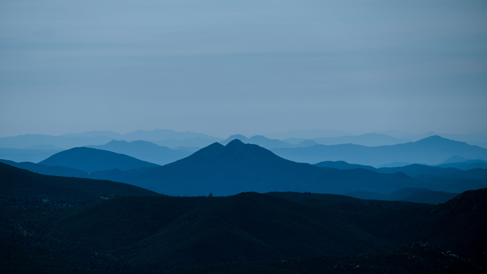
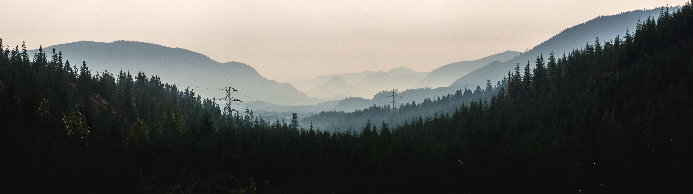

# dotfiles

|  |  |
|---|---|
| Distro   | Manjaro Linux x86_64 | |
| DE | GNOME Shell | |
| WM | Mutter | |
| WM Theme | [Matcha-dark-azul](https://github.com/vinceliuice/Matcha-gtk-theme) |   |
| Shell Theme | [Matcha-dark-azul](https://github.com/vinceliuice/Matcha-gtk-theme) \[GTK2/3\] |   |
| Icons | [Papirus-Dark](https://github.com/PapirusDevelopmentTeam/papirus-icon-theme) \[GTK2/3\] |   |
| Cursor | Xcursor-breeze-snow |   |
| Terminal | [Alacritty](https://github.com/alacritty/alacritty) |
| Terminal Theme | [nord](https://github.com/eendroroy/alacritty-theme) |
| File | [Nautilus](https://github.com/GNOME/nautilus) |
| **Porgrams** |  |
| Editor | [Code - OSS](https://code.visualstudio.com/), [Vim](https://github.com/vim/vim) |
| Web | [Brave](https://brave.com/) |
| Video | [VLC](https://www.videolan.org/vlc/) |
| Music | [MOC](https://wiki.archlinux.org/index.php/MOC), [VLC](https://www.videolan.org/vlc/) |
| Calendar | gnome-calendar |
| System monitoring | [htop](https://github.com/hishamhm/htop) |
| System infos | [neofetch](https://github.com/dylanaraps/neofetch) |
| ls | [coloris](https://github.com/athityakumar/colorls) |
| **Web** |  |
| Chrome style | [Stylus](https://chrome.google.com/webstore/detail/stylus/clngdbkpkpeebahjckkjfobafhncgmne) |
| Firefox style | [Stylus](https://addons.mozilla.org/en-US/firefox/addon/styl-us/) |
| GitHub style | [GitHub-Dark](https://github.com/StylishThemes/GitHub-Dark) |
| GitLab style | [dark-gitlab](https://gitlab.com/Avinash-Bhat/dark-gitlab) |
| Wikipedia theme | [Wikipedia-Dark](https://github.com/StylishThemes/Wikipedia-Dark) |
| Stack Overflow theme | [StackOverflow-Dark](https://github.com/StylishThemes/StackOverflow-Dark) |
| Protonmail theme | [pm-theme](https://github.com/amdelamar/pm-theme) |

## Shortcuts

| System | Shortcut |
|---|---|
| **Navigation** |
| Hide all normal windows | Super+Shift+K |
| Move to workspace above | Super+P |
| Move to workspace below | Super+; |
| Move window one monitor down | Super+Alt+K |
| Move window one monitor to the left | Super+Alt+J |
| Move window one monitor to the right | Super+Alt+L |
| Move window one workspace down | Super+Alt+; |
| Move window one workspace up | Super+Alt+P |
| Switch applications | Super+Tab |
| Switch to workspace 1 | Super+[ |
| Switch to workspace 2 | Super+] |
| **Windows** |
| Close window | Super+W |
| Hide window | Super+K |
| Toggle fulscreen mode | Super+Alt+I |
| Toggle maximization state | Super+I |
| View split on left | Super+J |
| View split on right | Super+L |
| **Launchers** |
| Launch terminal | Super+Return Super+1 |
| launch editor | Super+2 |
| Launch web browser | Super+3 |
| Launch social app | Super+4 |
| Launch file explorer | Super+5 |
| **Screenshots** |
| Copy a screenshot of an area to clipboard | Print |
| **Sound and Media** |
| Microphone mute/unmute | Super+M |
| Next track | Super+N |
| Play (or play/pause) | Pause |
| Previous track | Super+B |
| **System** |
| Lock screen | Super+Backspace |
| Log out | Super+Alt+Backspace |
| Show all applications | Super+D |

## Wallpapers

I do not own the right to the wallpapers iamges.

For wide screen

## Setup git bare

`mkdir dotfiles`

`git init --bare $HOME/dotfiles`

Add the following to you shell dotfile: `alias config='/usr/bin/git --git-dir=$HOME/dotfiles/ --work-tree=$HOME'`

`config config --local status.showUntrackedFiles no`

## To use it

`config add /path/to/file`

`config commit -m "Commit message"`

`config push`
