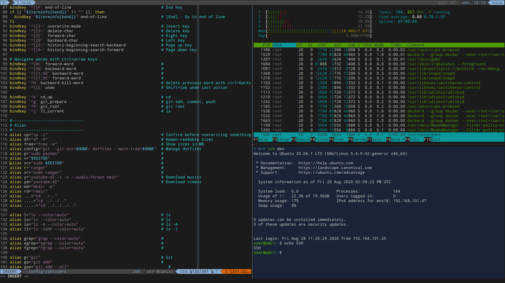

# 2O4's dotfiles



## Installation

```
mkdir .dotfiles && git init --bare $HOME/.dotfiles && echo "alias config='/usr/bin/git --git-dir=$HOME/.dotfiles/ --work-tree=$HOME'" >> .bashrc
```

Restart bash

Configure the git bare repo and pull.
```
config config --local status.showUntrackedFiles no && config remote add dotfiles https://github.com/2O4/dotfiles.git && config pull dotfiles master && config submodule update --init --recursive
```

```
echo "source ~/.config/zsh/zshrc" > ~/.zshrc
```

| Software | used |
|---|---|
| DE | GNOME Shell |
| WM | Mutter |
| WM Theme | [Matcha-dark-azul](https://github.com/vinceliuice/Matcha-gtk-theme) |
| Gnome Shell Theme | [Matcha-dark-azul](https://github.com/vinceliuice/Matcha-gtk-theme) \[GTK2/3\] |
| Icons | [Papirus-Dark](https://github.com/PapirusDevelopmentTeam/papirus-icon-theme) \[GTK2/3\] |
| Cursor | Xcursor-breeze-snow |
| Shell | [zsh](https://www.zsh.org/) |
| Terminal | [Alacritty](https://github.com/alacritty/alacritty) |
| Terminal Theme | [custom](.config/alacritty/alacritty.yml) |
| Terminal Multiplexer | [tmux](https://github.com/tmux/tmux) |
| File | [ranger](https://github.com/ranger/ranger) [Nautilus](https://github.com/GNOME/nautilus) |
| Editor | [Code - OSS](https://code.visualstudio.com/), [NeoVim](https://github.com/neovim/neovim) |
| Web | [Brave](https://brave.com/) |
| Font | [Droid Sans Mono Regular (Nerd Font)](https://github.com/ryanoasis/nerd-fonts/tree/master/patched-fonts/DroidSansMono) 11 |

Web browser customisation:
[Chrome style - Stylus](https://chrome.google.com/webstore/detail/stylus/clngdbkpkpeebahjckkjfobafhncgmne)
/ [Firefox style - Stylus](https://addons.mozilla.org/en-US/firefox/addon/styl-us/)
<br>Custom CSS:
[GitHub style - GitHub-Dark](https://github.com/StylishThemes/GitHub-Dark)
, [GitLab style - dark-gitlab](https://gitlab.com/Avinash-Bhat/dark-gitlab)
, [Wikipedia theme - Wikipedia-Dark](https://github.com/StylishThemes/Wikipedia-Dark)
, [Stack Overflow theme - StackOverflow-Dark](https://github.com/StylishThemes/StackOverflow-Dark)
, [Protonmail theme](https://github.com/amdelamar/pm-theme)

## Shortcuts

### Terminal shortcuts

The `change pane` shortcuts are shared between vim and tmux using [vim-tmux-navigator](https://github.com/christoomey/vim-tmux-navigator) plugin.

| Program | Action | Shortcut |
|--|--|--|
| tmux | Tmux prefix | Ctrl+a |
| tmux/vim | Change pane left | Ctrl+h |
| tmum/vim | Change pane down | Ctrl+j |
| tmum/vim | Change pane up | Ctrl+k |
| tmum/vim | Change pane right | Ctrl+l |
| tmux | New window | Ctrl+t |
| tmux | Previous window | Alt+b |
| tmux | Next window | Alt+n |
| tmux | New vertical split pane | Ctrl+a t |
| tmux | New horizontal split pane | Ctrl+a y |
| tmux | Swap pane | Ctrl+a Ctrl+o |
| tmux | Kill pane | Ctrl+a w |
| tmux | Kill window | Ctrl+a W |
| tmux | Kill all other windows | Ctrl+a Ctrl+w |
| tmux | Kill session | Ctrl+a q |
| vim | Exit insert | ii |
| vim | NerdTree toggle | \<space\>+n |
| tmux | Toggle mouse | Ctrl+a m |
| tmux | Edit config and reload | Ctrl+a Ctrl+e |

### WM shortcuts

| System | Shortcut |
|---|---|
| **Navigation** |
| Hide all normal windows | Super+Shift+J |
| Move to workspace above | Super+P |
| Move to workspace below | Super+; |
| Move window one monitor down | Super+Alt+J |
| Move window one monitor to the left | Super+Alt+H |
| Move window one monitor to the right | Super+Alt+L |
| Move window one workspace down | Super+Alt+; |
| Move window one workspace up | Super+Alt+P |
| Switch applications | Super+Tab |
| Switch to workspace 1 | Super+[ |
| Switch to workspace 2 | Super+] |
| **Windows** |
| Close window | Super+W |
| Hide window | Super+J |
| Toggle fulscreen mode | Super+Alt+K |
| Toggle maximization state | Super+K |
| View split on left | Super+H |
| View split on right | Super+L |
| **Launchers** |
| Launch terminal | Super+Return Super+1 |
| launch editor | Super+2 |
| Launch web browser | Super+3 |
| Launch social app | Super+4 |
| Launch file explorer | Super+5 |
| **Screenshots** |
| Copy a screenshot of an area to clipboard | Print |
| **Sound and Media** |
| Microphone mute/unmute | Super+M |
| Next track | Super+N |
| Play (or play/pause) | Pause |
| Previous track | Super+B |
| **System** |
| Lock screen | Super+Backspace |
| Log out | Super+Alt+Backspace |
| Show all applications | Super+D |

## Wallpapers

I do not own the right to the wallpapers images.

## To use it

`config add /path/to/file`

`config commit -m "Commit message"`

`config push`
